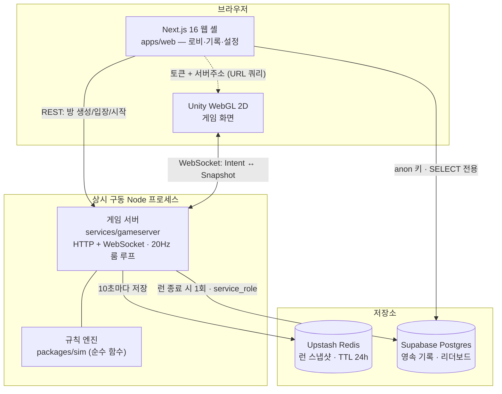
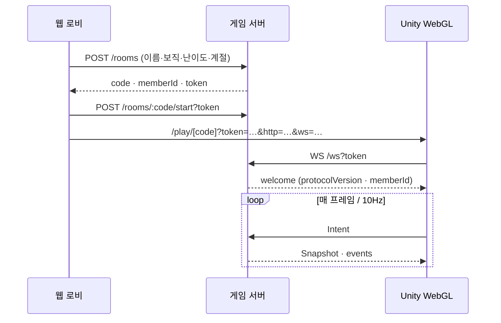
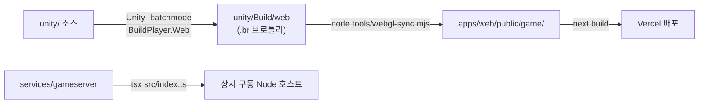

# SOLDIER : A DAY — 기술 아키텍처

> 18일 생존형 병영 체험 협동 RPG. Unity WebGL 2D 클라이언트 + 권위 서버 + Next.js 웹 셸.
> 이 문서는 **저장소에 실제로 있는 코드**를 기준으로 쓴 구조 설명이다. 기획 수치는 `docs/game_spec.md`,
> 구현 일정은 `docs/IMPLEMENTATION_PLAN.md`가 소유한다.

---

## 1. 설계 원칙

세 가지 규칙이 나머지 구조를 전부 결정한다. 코드 곳곳의 주석이 `ARCH-02`로 참조하는 것이 이것이다.

### 1.1 규칙은 한 곳에만 있다 — `packages/sim`

날짜·시간대·기온·퀘스트 진척·판정은 전부 `packages/sim`의 순수 함수가 결정한다.
클라이언트(Unity·웹)는 규칙을 **하나도 갖지 않는다**. 남은 시간을 스스로 세거나 완료를
예측하는 코드가 한 줄이라도 생기면, 두 클라가 서로 다른 것을 믿는 순간이 온다.

```
클라이언트가 보내는 것   = 의도(Intent)      "이 퀘스트를 붙잡고 있다"
서버가 돌려주는 것       = 스냅샷(Snapshot)  "지금 진척은 0.42다"
```

### 1.2 서버가 판정을 소유한다

판정이 곧 승패이므로 클라를 신뢰하지 않는다. 스냅샷에는 **원자료가 들어가지 않는다** —
특히 시드와 RNG 상태는 절대 나가지 않는다(나가면 기온 롤과 돌발을 미리 계산할 수 있다).
퀘스트도 남은 ms가 아니라 진척 비율만 준다. 이 투영은 `services/gameserver/src/snapshot.ts`
한 곳에서만 일어난다.

유일한 예외는 `questCleared`다. 미니게임 판의 통과 여부는 클라만 알 수 있으므로 클라가
신고하되, 서버가 거절할 수 있는 것(구역·시간대·소유자·이동 중·합동 인원·최소 소요 시간
게이트)은 전부 그대로 거절한다.

### 1.3 프로토콜은 단일 정의에서 양쪽으로 생성된다

`packages/protocol`의 zod 스키마 하나가 TS 타입과 Unity C# DTO의 공통 출처다.
손으로 맞추면 반드시 어긋난다.

```
zod 스키마 ──▶ z.toJSONSchema() ──▶ tools/csharpgen ──▶ unity/.../Generated/Protocol.cs
     │
     └────────▶ z.infer<>          ──▶ TS 타입 (web · gameserver)
```

### 1.4 결정론

`packages/sim/src/rng.ts`는 mulberry32를 순수 함수 형태로 구현한다(`Math.random()` 금지).
RNG 상태가 `RunState` 안에 들어가므로 스냅샷을 저장했다 복구해도 이후 롤이 어긋나지 않고,
같은 시드 + 같은 입력열이면 언제나 같은 런이 나와 헤드리스 밸런싱 시뮬레이터가 성립한다.
sim은 시계도 갖지 않는다 — 시간은 서버가 `tick` 이벤트로 주입한다.

---

## 2. 시스템 구성



### 왜 게임 서버가 Vercel Function이 아닌가

두 가지 이유가 `services/gameserver/src/index.ts` 상단에 못박혀 있다.

1. Next 16의 Route Handler는 WebSocket을 지원하지 않는다(연결이 응답 생성 후 닫힌다).
2. 20Hz 룸 루프는 상태를 든 장수(長壽) 프로세스가 필요하다.

그래서 웹 셸(Vercel)과 게임 서버(별도 호스트)는 오리진이 다르고, 그 사이는 CORS와
단기 세션 토큰으로 잇는다.

---

## 3. 모노레포 레이아웃

npm workspaces. 루트 `package.json`이 `apps/*`, `packages/*`, `services/*`, `tools/*`를 묶는다.

| 워크스페이스 | 이름 | 역할 | 런타임 의존성 |
|---|---|---|---|
| `packages/sim` | `@sad/sim` | **규칙 엔진.** 결정론적 순수 함수 | 없음 (0개) |
| `packages/protocol` | `@sad/protocol` | 서버↔클라 경계 스키마 단일 정의 | zod |
| `packages/assets` | `@sad/assets` | 에셋 카탈로그·예산 (기계가 읽는 `ASSETS.md`) | `@sad/sim` |
| `services/gameserver` | `@sad/gameserver` | 권위 서버 (HTTP + WS + 룸 루프) | ws, @upstash/redis, @supabase/supabase-js |
| `apps/web` | `@sad/web` | Next.js 16 웹 셸 (로비·기록·Unity 호스트) | next 16.2, react 19.2, tailwind 4 |
| `tools/csharpgen` | `@sad/csharpgen` | 프로토콜 → C# DTO 생성기 | — |
| `tools/simrunner` | `@sad/simrunner` | 헤드리스 밸런싱 시뮬레이터 | `@sad/sim` |
| `tools/blockout` | `@sad/blockout` | 그레이박스 지오메트리 생성기(OBJ) | `@sad/assets` |
| `unity/` | — | Unity 2D 클라이언트 (워크스페이스 아님) | — |

의존 방향은 한쪽으로만 흐른다.

```
sim ◀── protocol ◀── gameserver
 ▲          ▲            │
 │          └──── web ◀──┘ (REST/WS)
 └──── assets ◀── blockout
              └── simrunner
```

`sim`은 아무것도 import하지 않는다. `protocol`은 규칙을 모른다. 이 두 문장이 깨지면
클라이언트가 규칙을 갖게 되는 경로가 열린다.

---

## 4. 규칙 엔진 — `packages/sim`

### 4.1 형태

```ts
step(state: RunState, event: SimEvent): { state: RunState, effects: Effect[] }
```

유일한 진입점이다(`src/step.ts`). 시계도, I/O도, 난수 소스도 갖지 않는다.
입력은 `beginDay` · `tick` · 플레이어 의도이며, 출력은 새 상태와 이펙트 목록이다.

### 4.2 모듈

| 파일 | 담당 |
|---|---|
| `step.ts` | 진입점 · 시간대 진행 · 의도 처리 |
| `run.ts` / `types.ts` | `RunState` 정의와 생성 |
| `rng.ts` | mulberry32 결정론 난수 |
| `phases.ts` / `zones.ts` | 시간대 6종 · 구역 36종과 인접·이동 소요 |
| `quests.ts` | 일과·보직·합동·돌발 퀘스트 생성 |
| `judge.ts` | 하루 판정(조건 A~D) · 퇴소·해체 |
| `condition.ts` / `warmth.ts` | 컨디션 6종 감소·회복 · 극혹한 보온 게이지 |
| `weather.ts` | 기온 밴드 롤(체감온도 공식) |
| `discipline.ts` / `ranks.ts` | 군기 밴드 · 복무 점수 · 진급 심사 |
| `delegation.ts` | 잡무 하달·거부·분대장 재지정 |
| `evacuation.ts` | 후송·복귀·강제 취침·이탈 |
| `supply.ts` | 보급일 · 청구서 · 포인트 |
| `hidden.ts` | 히든 퀘스트 6종 · 엔딩 |
| `radio.ts` | 무전 3단계(분대 공통 정보 차단) |
| `curriculum.ts` / `training.ts` | 18일 커리큘럼 해금 · 훈련 |
| `persist.ts` | `RunState` ↔ JSON 직렬화 (저장 포맷 버전 포함) |

### 4.3 데이터는 코드가 아니라 JSON

기획서 수치는 `packages/sim/data/*.json`에 있고, 각 파일은 `_source`로 기획서 절을
가리킨다. 밸런스를 고치는 데 코드 수정이 필요하면 안 된다.

| 파일 | 내용 |
|---|---|
| `quests.json` | 잡무 31 · 돌발 9 · 회복 8 · 보직/합동 정의 |
| `zones.json` | 구역 36종(본영 26 + 훈련장 10)과 인접 그래프 |
| `phases.json` | 시간대 6종 |
| `curriculum.json` | 18일 일자별 해금 |
| `temperature.json` | 계절·체감온도 공식 · 밴드 6종 |
| `condition.json` · `discipline.json` · `ranks.json` · `supply.json` · `hidden.json` | 각 시스템 수치 |

### 4.4 테스트

`packages/sim/test`에 22개 스위트. 기획서 수치를 그대로 assert하는 불변식 테스트가
중심이며, `determinism.test.ts`가 "같은 시드 → 같은 런"을 지킨다.

---

## 5. 프로토콜 — `packages/protocol`

### 5.1 메시지

```
클라 → 서버   Intent (discriminated union)
  ready · move · interact · questCleared · jointStep · quickCommand · chat
  voteSkip · delegateChore · vetoChore · leaderReassign · voteLeader · fileClaim

서버 → 클라   ServerMessage
  welcome  최초 1회 — protocolVersion · memberId · code
  lobby    좌석 4개 상태
  snapshot 10Hz — 전체 상태 투영 (seq 단조 증가)
  events   표시용 사건 묶음
  error
```

### 5.2 미니게임 원형 14종

퀘스트마다 새 게임을 만들지 않는다. `minigameSchema`가 원형 14종(+ RANDOM 소환)을
판별 union으로 정의하고, **파라미터로 변주**한다. 파라미터 객체는 한 겹 감싸지 않고
평평하게 둔다 — C# 생성기가 판별 union을 필드 합집합으로 펴기 때문에 중첩하면
Unity가 첫 variant 말고는 파라미터를 못 읽는다.

제한 시간은 미니게임 파라미터에 없다. `workSeconds`가 곧 제한 시간이다 — 두 곳에
두면 반드시 어긋난다.

### 5.3 코드 생성

```bash
npm run codegen:csharp   # → unity/Assets/Scripts/Generated/Protocol.cs
```

`src/schemas.ts`의 `CODEGEN_TARGETS`에 올라간 타입만 C#으로 나간다
(`Snapshot` · `ServerEvent` · `ServerMessage` · `LobbyState` · `Intent`).

---

## 6. 권위 서버 — `services/gameserver`

### 6.1 구성

| 파일 | 역할 |
|---|---|
| `index.ts` | HTTP 라우트 · WS 업그레이드 · 전역 틱 루프 |
| `room.ts` | **1방 = 1분대(4인 고정).** 상태 소유 · sim 구동 · 브로드캐스트 |
| `store.ts` | 방 레지스트리 · 초대 코드 · 세션 토큰 · 청소 |
| `snapshot.ts` | `RunState` → `Snapshot` 투영 · `Effect` → `ServerEvent` 축소 |
| `persistence.ts` | 저장소 인터페이스 + 인메모리 구현 |
| `stores/upstash.ts` · `stores/supabase.ts` | 실제 어댑터 |

### 6.2 주기

```
시뮬레이션  20Hz  (TICK_MS = 50ms)
스냅샷 송신 10Hz
스냅샷 저장 10초마다
빈 방 청소  60초마다
재접속 유예 30초
```

재접속 유예 30초는 밸런스 규칙이다. 끊기자마자 이탈 대리로 넘기면 새로고침 한 번으로
그날 필수를 전부 완수한 상태가 되어 판정을 통째로 우회할 수 있다.

### 6.3 HTTP API

| 메서드 | 경로 | 설명 |
|---|---|---|
| `GET` | `/health` | 상태 · 방 개수 |
| `POST` | `/rooms` | 방 생성 (생성자가 방장) → `{ code, memberId, token }` |
| `GET` | `/rooms/:code` | 로비 상태. 없으면 저장된 스냅샷에서 되살린다 |
| `POST` | `/rooms/:code/join` | 보직을 골라 입장 (보직당 정확히 1명) |
| `POST` | `/rooms/:code/start` | 방장만. `?token=` 검증 |
| `GET` | `/records` | 리더보드 |
| `GET` | `/records/:runId` | 하달 장부 |
| `WS` | `/ws?token=` | 게임 연결 |

초대 코드는 6자리이며 알파벳에서 헷갈리는 글자(`0/O`, `1/I`)를 뺐다.

### 6.4 세션 핸드오프

WS에 붙으려면 로비가 발급한 단기 토큰이 필요하다. 스키마를 통과하지 못한 입력은
조용히 버린다 — 클라를 신뢰하지 않는다.



---

## 7. 저장소

기획서 표 18-1이 그은 선을 그대로 따른다. 성격이 정반대인 둘을 한 저장소에 묶으면
기록에 만료가 붙거나 스냅샷에 스키마가 붙는다.

| | 런 스냅샷 | 영속 기록 |
|---|---|---|
| 수명 | 24시간 (TTL) | 영원 |
| 접근 | 코드 하나로 읽고 쓰기 | 정렬·집계·조회 |
| 쓰기 빈도 | 10초마다 | 런당 1회 |
| 대상 | Upstash Redis (`sad:run:{code}`) | Supabase Postgres |

두 경로 모두 인터페이스(`RunSnapshotStore` · `RecordStore`) 뒤에 있고, 환경변수가
없으면 인메모리 구현으로 떨어진다 — 로컬 개발과 테스트는 DB 없이 돌아야 한다.

### 스키마 (`services/gameserver/sql/001_records.sql`)

```
runs(run_id PK, finished_at_day, status, season, difficulty,
     ending_id, ending_label, discipline, hidden text[], failed_at, created_at)
run_members(run_id FK, name, role, rank, service_score,
            evacuations, delegations_given, delegations_received)  PK(run_id, role)
```

분대원을 별도 테이블로 둔 이유는 조회다 — 보직별 완주 횟수·계급 분포·하달 장부 집계가
전부 이 테이블의 질의다.

**접근 모델:** 쓰기는 게임서버만(service_role, RLS 우회). 읽기는 누구나(anon).
그래서 SELECT 정책만 만들고 INSERT/UPDATE/DELETE 정책은 만들지 않았다 — 정책이 없으면
service_role 외에는 쓸 수 없고, 그게 의도다.

---

## 8. 웹 셸 — `apps/web`

Next.js 16 App Router · React 19 · Tailwind 4. **3D도 규칙도 갖지 않는다.**
방을 만들고 토큰을 받아 Unity에 넘겨주는 것까지가 역할이다.

| 라우트 | 역할 |
|---|---|
| `/` | 진입 |
| `/lobby` | 방 생성 · 참가 (보직 4종 선택) |
| `/room/[code]` | 대기실 — 좌석·준비·시작 |
| `/play/[code]` | **Unity WebGL 호스트** |
| `/records` | 리더보드 (Supabase 직접 조회) |
| `/ledger/[runId]` | 하달 장부 |
| `/settings` | 접근성·표시 설정 |

`/records`와 `/ledger`는 게임 서버를 거치지 않고 Supabase를 anon 키로 직접 읽는다.
게임 서버가 죽어 있어도 떠야 하고, 이미 끝난 런의 기록에는 규칙 엔진이 관여할 일이 없다.

`src/components/hud/`의 HUD 컴포넌트들과 `useGameSocket`은 DOM 디버그 클라이언트
시절의 자산이다. 현재 게임 화면은 Unity 단독이며(미니게임 원형 14종이 Unity에만 있으므로
화면이 둘이면 규칙도 둘이 된다), `useGameSocket`은 스냅샷을 그대로 그리는 훅으로 남아 있다 —
규칙을 하나도 갖지 않고, 보간(`useSmoothClock`)은 표시용일 뿐 판정에 영향이 없다.

---

## 9. Unity 클라이언트 — `unity/`

### 9.1 네트워크 층 (`Assets/Scripts/Net/`)

| 파일 | 역할 |
|---|---|
| `GameSocket.cs` | 서버와의 유일한 통로. WebGL은 `.jslib` 브릿지, 에디터·데스크톱은 `ClientWebSocket` |
| `GameClient.cs` | JSON ↔ 생성된 DTO. 판정도 예측도 하지 않는다. seq 역행 스냅샷은 버린다 |
| `NetBootstrap.cs` | 방 생성 → 시작 → WS 연결 → 스냅샷 반영을 잇는 수직 절개 |
| `LobbyClient.cs` | REST 호출 |
| `SquadView` · `ZoneMap` · `Hud*` · `CameraRig` · `CharacterRig` | 스냅샷 표시 |
| `Minigame/*Board.cs` | 미니게임 원형 14종 판 구현 |

WebGL에는 커맨드라인 인자가 없으므로 서버 주소·토큰은 **URL 쿼리**로 받는다
(`M0GetQuery()` → `.jslib`). 빌드를 다시 하지 않고 로컬·원격을 바꿔 붙일 수 있어야 한다.

### 9.2 에셋 파이프라인

에셋 파일 대신 **에셋을 만드는 코드**가 저장소에 있다.

```
tools/sprites/*.py (Python + Pillow)
  ├─ chars/    캐릭터 8레이어 시트 (셀 32×48)
  ├─ tiles/    바닥·벽 오토타일 (32×32)
  ├─ props/    Y-sort 대상 개별 스프라이트
  ├─ vfx/      파티클 알갱이
  ├─ art2d.json      씬 빌더가 읽는 색인
  └─ base_map.json   부대 본영 — 구역 15종 + 타일 레이어 + 상호작용 지점
        │
        ▼
unity/Assets/Art/2d/
        │
        ├─ Sprite2DImport.cs (AssetPostprocessor)
        │     PPU 32 고정 · Point 필터 · 압축 없음 · 밉맵 없음 · 피벗 (16,2)
        ▼
BaseScene.cs (Editor)  →  Assets/Scenes/Base.unity  (단일 심리스 맵)
```

임포트 규칙을 코드에 둔 이유는 스프라이트가 수백 장이기 때문이다 — 하나라도 필터가
Bilinear로 남으면 그 그림만 뿌옇게 뜨고 누가 안 맞췄는지를 눈으로 찾게 된다.

좌표 규약: 타일 `(tx, ty)` → Unity 셀 `(tx, H − ty − 1)`. 뒤집고 나면 "화면 아래가 앞"이라는
Y-sort 정렬이 y 하나로 성립한다.

### 9.3 에디터 파이프라인 (`Assets/Editor/Pipeline/`)

배치모드에서 도는 것이 요점이다 — 에디터를 띄우지 않고도 "지금 상태가 실제로 실행되는가"를
확인할 수 있어야 한다.

```bash
Unity -batchmode -quit -projectPath unity \
  -executeMethod SoldierADay.EditorTools.BuildPlayer.Web -out Build/web
```

`BaseScene` · `M0RealScene`(씬 생성) · `BuildPlayer`(Mac/WebGL) · `AssetBudgetReport` ·
`CaptureScene`/`CaptureAsset`(스크린샷) · `PlayProbe`/`HeapProbe`/`SnowProbe`(성능 측정).
M0 측정 씬은 빌드에서 뺀다 — 게임이 아니라 숫자를 재는 씬이다.

---

## 10. 빌드와 배포



번들은 저장소에 넣지 않는다 — 14MB짜리 바이너리가 커밋마다 통째로 갈리면 이력이
못 쓰게 된다. `.gitignore`가 `apps/web/public/game/`을 막는다.

### 브로틀리 헤더

Unity는 압축 방식을 **확장자로만** 알린다(`.br`). 서버가 `Content-Encoding: br`을 붙이지
않으면 로더가 "Unable to parse Build/xxx.br"로 죽고, `Content-Type`이
`application/octet-stream`이면 `WebAssembly.compile`이 거절한다. `apps/web/next.config.ts`가
세 확장자(`.wasm.br` / `.js.br` / `.data.br`)에 헤더를 붙인다.

압축 해제 폴백을 켜면 헤더 없이도 돌지만 번들에 해제기가 실려 첫 다운로드가 커진다 —
초기 다운로드 예산 25MB를 지키는 쪽을 골랐다.

또 하나: 픽셀 퍼펙트 카메라가 정수배로 올리므로 `createUnityInstance`에
`devicePixelRatio: 1`을 넘긴다. DPR까지 곱하면 배율이 정수가 아니게 되어 격자가 어긋난다.

---

## 11. 개발 명령

```bash
npm run dev            # 웹 셸 (apps/web)
npm run dev:server     # 게임 서버 (tsx watch)
npm run sim -- …       # 헤드리스 밸런싱 시뮬레이터
npm run test           # 전 워크스페이스 vitest
npm run typecheck      # 전 워크스페이스 tsc --noEmit
npm run codegen:csharp # 프로토콜 → Unity C# DTO
npm run assets:check   # 에셋 예산 검사
node tools/webgl-sync.mjs           # Unity 빌드 → public/game
python3 tools/sprites/generate.py   # 2D 에셋 재생성
```

---

## 12. 환경변수

| 변수 | 소비자 | 없으면 |
|---|---|---|
| `NEXT_PUBLIC_GAME_HTTP_URL` | 웹 셸 | `http://localhost:8080` |
| `NEXT_PUBLIC_GAME_WS_URL` | 웹 셸 | `ws://localhost:8080/ws` |
| `NEXT_PUBLIC_SUPABASE_URL` · `NEXT_PUBLIC_SUPABASE_PUBLISHABLE_KEY` | 웹 셸 (읽기 전용) | 기록 화면 비활성 |
| `PORT` · `CORS_ORIGIN` | 게임 서버 | `8080` · `*` |
| `KV_REST_API_URL` · `KV_REST_API_TOKEN` | 게임 서버 | 인메모리 스냅샷 |
| `SUPABASE_URL` · `SUPABASE_SERVICE_ROLE_KEY` | 게임 서버 | 인메모리 기록 |

Upstash는 `UPSTASH_REDIS_REST_*` 이름으로도 받아준다 — Vercel 마켓플레이스로 붙였는지
직접 가입했는지를 코드가 알 필요가 없다.

`service_role` 키는 서버 전용이며 절대 브라우저로 나가면 안 된다.

---

## 13. 검증 전략

| 층 | 방법 |
|---|---|
| 규칙 | `packages/sim/test` 22개 스위트 — 기획서 수치 불변식 + 결정론 |
| 프로토콜 | `quests.json` 전건이 `minigameSchema`를 통과하는지 데이터 테스트로 확인 |
| 직렬화 | 인메모리 스냅샷 저장소도 실제 `serializeRun`을 태운다 — Redis로 바꿔도 같은 경로 |
| 밸런스 | `tools/simrunner` — Unity 없이 18일을 수 밀리초에 돌려 완주율 측정 |
| 클라 | `NetBootstrap` 수직 절개 · 에디터 배치모드 빌드 · `PlayProbe`/`HeapProbe` 성능 측정 |

---

## 14. 알려진 경계와 제약

- **게임 서버는 단일 프로세스 · 인메모리 룸 레지스트리다.** 수평 확장하려면 룸을
  노드에 고정하는 라우팅이 필요하다. 지금은 스냅샷 TTL 덕분에 프로세스가 죽어도
  같은 코드로 이어하기가 되는 수준까지만 대비돼 있다.
- **세션 토큰은 인메모리다.** 서버 재시작 시 토큰이 무효가 되고 로비를 다시 거쳐야 한다.
- **CORS 기본값이 `*`다.** 배포 시 `CORS_ORIGIN`을 반드시 좁혀야 한다.
- **`memberId`는 `Math.random()` 기반 6자리다.** 방 안에서만 유일하면 되지만 추측 가능하며,
  실제 권한은 토큰이 쥔다.
- **CI 설정이 저장소에 없다.** `test`/`typecheck`/`assets:check`는 수동 실행이다.